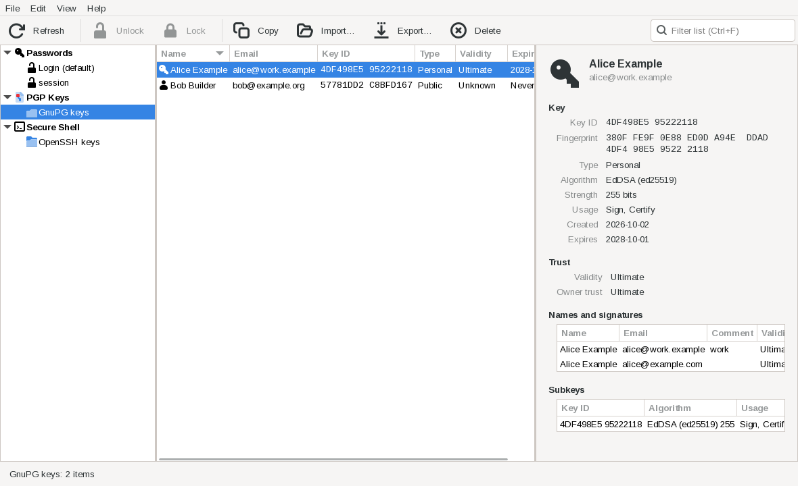

# landhorse



A GTK3 manager for passwords, keyrings, PGP keys and SSH keys, modelled on GNOME's
[Seahorse](https://gitlab.gnome.org/GNOME/seahorse) ("Passwords and Keys") but with a
conventional desktop layout:

* a **menu bar and a labelled toolbar** instead of hamburger and popover menus;
* **three panes**: the type of thing on the left, a list of that type in the middle, and
  the details of the selected item on the right;
* **tree views** with sortable, resizable columns, a filter box, a status bar and a
  right-click menu.

## What it manages

| Type tree | Source | Actions |
|---|---|---|
| Passwords → each keyring | The Secret Service D-Bus API (gnome-keyring, KeePassXC) | Show and copy passwords, delete, lock and unlock keyrings |
| PGP Keys → GnuPG keys → Private keys / Public keys → each email address | The `gpg` command (`--with-colons`) | Copy, export or publish public keys, import, revoke, delete |
| PGP Keys → GnuPG keys → My Keys | Your default identity: `default-key` in gpg.conf, Seahorse's setting, or your first private key | As above |
| PGP Keys → Keyservers | A search bar over the configured keyservers | Import found keys, or copy, export and encrypt to them without importing |
| Secure Shell → OpenSSH keys | Key files in `~/.ssh` | Copy (or double-click) and export public keys, change passphrases (saving them in the login keyring), delete key pairs |
| Secure Shell → SSH agent | The agent at `$SSH_AUTH_SOCK` | Copy (or double-click) and export public keys, remove keys from the agent |

Keyrings also group their passwords: network passwords by host, plus any attributes you
choose in Edit → Preferences (for example `service`), each with a subcategory per value.

A PGP key's details have drop areas: drop files to encrypt them to the key (saved as
`<file>.gpg`) or, for your own keys, to sign them (detached signatures, `<file>.sig`).
Right-click a key for "Encrypt Text…" or "Sign or Encrypt Text…". Encrypting to a key gpg
hasn't verified asks for confirmation first.

Every field in the detail view has a copy button. Showing or copying a password from a
locked keyring brings up the system unlock prompt. Every delete asks for confirmation and
says exactly what will be removed.

**Keyservers.** "Publish…" uploads a public key to a keyserver. By default landhorse uses
the same keyservers as Seahorse (the `org.gnome.crypto.pgp` `keyservers` setting, which
Ubuntu sets to `hkps://keyserver.ubuntu.com`); set `pgp.keyservers` to change them.

**Signatures.** A key's Related items list the keys in your keyring that signed it (and
that it signed). Names and signatures lists each name's signatures; double-click one to go
to the signing key, or, if you don't have it, to search the keyservers for it in a pane
below the details, where right-click imports it.

**Revoking.** "Revoke…" in a key's right-click menu revokes it with a revocation
certificate (choose a file, drop one, or paste it), which is checked against the key before
anything changes. If the key's secret part is here, a certificate can be generated instead,
after two confirmations. Revocations are always published, so a keyserver must be
configured.

Not done yet: creating passwords, keyrings and keys; editing; trust and signing; keyserver
search; certificates (PKCS#11).

## Building

landhorse needs Go and the GTK3 development files (`sudo apt install libgtk-3-dev` on
Debian and Ubuntu). It uses cgo for GTK, so it builds natively on Linux only.

```sh
go run mage.go binary
./landhorse
```

The first build compiles the GTK bindings and takes a couple of minutes.

## Ubuntu packages

```sh
go run mage.go deb                 # all supported releases
go run mage.go debSeries noble     # one release: noble (24.04) or resolute (26.04)
```

This builds source and binary packages in podman containers of each release, runs the
tests and lintian, and writes them to `dist/deb/<series>/`. `go run mage.go debTest`
then checks that installing the package replaces seahorse cleanly. The `landhorse` package
replaces `seahorse`: installing it removes seahorse, and it provides the `seahorse` command
and package so that desktop metapackages, LibreOffice and other packages that depend on
seahorse stay installed and working.

**Package repository:** none yet. Packages are not attached to GitHub Releases (those
carry only the binary archives); they will be published through a PPA, and this section
will give its URL and the commands to add it and install landhorse.

To publish to a Launchpad PPA, sign and upload each release's source package:

```sh
debsign -k<fingerprint> dist/deb/noble/*_source.changes
dput ppa:<you>/<ppa> dist/deb/noble/*_source.changes
```

## Usage

```sh
landhorse                       # open the window
landhorse --category ssh:/home/me/.ssh
landhorse list                  # print every category and item to the terminal
```

`list` prints category keys, which `--category` accepts to pick the startup selection.

Keyboard: F5 refreshes, Ctrl+F filters the list, Ctrl+O imports, Ctrl+S exports, Ctrl+L
locks. In the item list, Ctrl+C copies and Delete deletes.

## Configuration

landhorse reads `~/.config/landhorse/landhorse.yml` if it exists, or the file named by
`--config-file`. Every key is optional; `landhorse.yml` in this repository lists them with
their defaults. You can hide a backend, point it at a different GnuPG home or SSH
directory, or use a different `gpg` binary.

## Layout

| Path | Purpose |
|---|---|
| `cmd/landhorse` | `main`, which only calls the entrypoint. |
| `pkg/entrypoints/landhorse` | Command line, config and logging; the `run` and `list` commands. |
| `pkg/backend` | The toolkit-independent model the UI renders: groups, categories, items, details and optional actions. |
| `pkg/secretservice` | Secret Service D-Bus client and its backend. |
| `pkg/pgp` | `gpg --with-colons` parser and its backend. |
| `pkg/sshkeys` | `~/.ssh` scanner and its backend. |
| `pkg/ui` | The GTK3 window. The only package that uses cgo. |
| `tools/sandbox` | Runs landhorse on a virtual display against throwaway keys, for UI testing. |

See `AGENTS.md` for development conventions.
